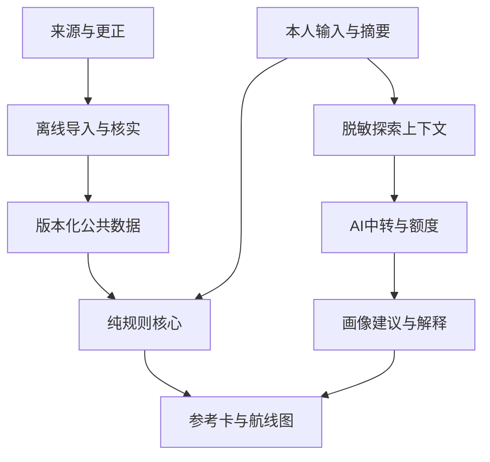

# 南溟系统、接口与安全规格

<!-- PROJECT-STATUS:START -->
> 统一进度（2026-09-12，2026-09-12-refactor-and-hygiene）：TASK-03 数据核实与发布完成；荣县一中增强模式接入完成（质量慧析 accuracy-v1.2 固定版本解析学校复盘工作簿，建成本地成绩库与按人分片的发布产物）；TASK-11 小范围试用经负责人决定跳过，GATE-PILOT 未通过。
> 已完成：TASK-01、TASK-02、TASK-03、TASK-04、TASK-05、TASK-06、TASK-07、TASK-08、TASK-09、TASK-10；进行中：无；未开始：TASK-12、TASK-13、TASK-14。
> 已跳过：TASK-11（项目负责人（用户）决定）；相应门禁未通过，不得按已完成或待办处理。
> 本次验证：20 个测试文件、272 项通过、0 失败；真实招生发布记录为 51878；已通过：GATE-LOCAL。
> 下一步：TASK-11 已按负责人决定跳过。可选的后续：TASK-12 数据扩容、TASK-13 本人身份（增强模式的验证码目前只是本地演示，正式上线需要服务端校验与限流）、TASK-14 部署运维。。完整进度及操作见[项目进度](../nanhang-app/docs/PROJECT_STATUS.md)。历史验证记录不代表当前状态。
<!-- PROJECT-STATUS:END -->

版本：1.0.0｜日期：2026-09-09｜状态：实现基线，尚未部署

## 1. 技术决策

| 层 | 决定 | 采用原因与限制 |
|---|---|---|
| Web | React + TypeScript + Vite，独立项目 | 与质量慧析可复用纯逻辑兼容，不继承其整页教学驾驶舱 |
| 领域核心 | 纯TypeScript包，禁止DOM、网络和LLM依赖 | 相同规则可在浏览器、Node和测试中复用 |
| 数据工程 | Python脚本＋SQLite离线暂存 | Excel工作表/单元格解析、关系检查与发布；图片/OCR仅作可选补充证据 |
| 公共数据 | 不可变JSON分片＋manifest＋哈希 | 小样本无需在线招生数据库；后续可替换读取适配器 |
| 在线服务 | Node + TypeScript模块化单体，HTTP入口与业务逻辑分离 | 可适配SCF Web Function；复用北辰模式但不复制旧协议 |
| AI会话与额度 | 复用改造后的共享Redis状态接口 | 生产多实例下保持原子与幂等；故障时关闭付费AI请求 |
| 本人摘要 | 首版本地内存，用户主动保存时本地存储或下载 | 首版不建云端成绩库，不把本地导入误当认证 |
| 后续云端成绩 | 托管PostgreSQL作为默认设计，独立访问仓储接口 | 仅P4自动接入确有需要时引入；当前不采购、不建库 |
| 部署 | 独立静态站点＋独立SCF服务作为默认方案 | 具体域名、云资源、网络与额度在发布任务验证；不沿用现有项目URL |

前端与后端由不同子目录构建，版本从同一版本文件生成。依赖版本由实现Agent根据可安装性、锁文件与构建验证确定；本包不把源仓库版本号视为南溟必须锁定的版本。

## 2. 模块拓扑



AI画像经学生确认后成为偏好输入；AI不能写入公共招生事实或覆盖资格判断。图中本人摘要默认不进入公共数据发布链。

## 3. 目录与模块职责

```text
apps/web/                 学生界面、打印、设备本地存储
apps/api/                 HTTP适配、身份、额度、AI适配器
packages/contracts/       JSON Schema、生成类型、版本检查
packages/domain/          资格、成绩定位、历史比较、排序
packages/data-reader/     manifest校验、分片读取、撤回状态
packages/school-adapter/  质量慧析到本人摘要的转换
pipelines/                Excel主输入、可选来源补证、校验与发布
data/synthetic/           合成测试数据，不能发布为真实招生信息
data/releases/            仅可公开且核实的发布数据
tests/                    验收案例与集成验证
docs/                     本交接规格和后续决策记录
```

目录中的`apps/web`已于TASK-07创建，提供本地无AI学生流程与TASK-08可选AI面板；`apps/api`已于TASK-08创建为本机HTTP适配层，使用本地假上游与内存状态存储，未部署、未接生产依赖。`packages/ai-gateway`提供TASK-08幂等、额度、SSE与输出安全纯核。`packages/exploration`提供TASK-06内容与画像纯函数，TASK-03的Excel主管线在`pipelines/task03`。其余未创建目录仍是目标结构，接口边界不得省略。

## 4. 模块接口

| 模块 | 输入 | 输出 | 明确禁止 |
|---|---|---|---|
| school-adapter | 已选定单个学生的源记录＋字段确认信息 | StudentProfileEnvelope＋转换警告 | 自动按同名跨班合并、输出其他学生、补造日期和赋分来源 |
| academic | 有效profile或scenario＋选定数据版本 | AcademicContext、rank_interval或不可比原因 | 月考直接查高考表、把模拟线当省线 |
| eligibility | 完整选科与条件声明＋offering要求 | PASS/FAIL/UNKNOWN、检查范围 | 以兴趣抵消硬条件 |
| matching | AcademicContext＋候选数据＋已确认偏好 | MatchResult | 调用LLM、使用未发布事实、组线当专业线 |
| career | 学生表达＋有来源的专业内容 | 待确认画像建议 | 发布未核实招生事实、自动认定学生能力上限 |
| route-map | 已确认画像＋MatchResult＋学生目标 | 结构化航线图 | 根据单科总分承诺可提分数 |
| data-publisher | 已核实离线记录＋证据索引 | 新release及覆盖报告 | 原地修改旧release、包含私有学生数据 |

所有核心函数显式接收规则版本和数据版本，不依赖当前时间决定事实范围；请求开始时注入now，测试可固定。

## 5. 标准学生档案

contracts/student-profile.schema.json是首版结构基线。必有envelope_version、subject_id、target_exam_year、province、selection、observations、provenance。

source侧提供稳定ID映射，导入南溟的subject_id使用不含姓名、身份证、生日的随机内部标识。缺稳定映射时允许local临时ID，只在本次摘要内有效；不得用于自动从服务器关联档案。

### 5.1 质量慧析字段映射

复用基线为accuracy-v1.2的6f70eab4e6e9ecadc00149b1387103b45b5d8e2b，main仅用作对照。

实现状态（2026-09-10）：已按该固定提交取得并核对 `types.ts`、`parser.ts`、`score-validation.ts` 及必要依赖，在 `nanhang-app/packages/school-adapter` 实现 `adaptAccuracyV12SelectedStudent` 单人入口、真实字段结构合成样例和冲突回归。完整映射、Git blob 和未知值处理见 [accuracy-v1.2 单人摘要字段映射](../nanhang-app/docs/ACCURACY_V1_2_FIELD_MAPPING.md)。没有真实工作簿，本状态不代表实数据验收。

| 质量慧析字段 | 南溟字段/处理 | 缺口 |
|---|---|---|
| StudentScore.exam/rawExam | observations[].exam_id/source_exam_label | 不是日期；occurred_at未知时null |
| school/classNo/name | 仅来源侧选人和人工关联 | 不能作为跨年唯一身份，默认不传AI |
| track/combination | selection首选与再选 | 现有配置带学校规则，需要确认完整组合 |
| total/totalSource | total.value/origin | 仅明确 source 的有效值进入摘要；缺失或 reconstructed 总分值不进入定位，且不按科目重建 |
| subjects/subjectStates | subjects[code]{value,state,score_basis,max_score} | 现有对象没有逐科原始/赋分元数据，不根据科目名称自动断言 |
| cityRank/schoolRank | ranks[] | 已保留city/school范围；population与同分口径保持未知，不转为省位次 |
| Threshold | contextual_lines[] | 需补来源、参照群体及mock标识；不导入公共省控制线表 |
| source/scoreIssues/scoreConflicts | provenance定位与quality_flags | 原始异常可能含姓名，仅本地保留详细信息 |
| profile.overallConfidence | 不映射到学生可信度或录取概率 | 原字段是工程启发式质量提示 |

选择本人后再导出；在教师设备内保留源记录定位。学生导入数据允许查看警告和修正，修正后来源标记改为user_edited。

### 5.2 不受支持或冲突数据

envelope_version主版本不支持→拒绝并提示升级；额外字段默认拒绝，防止把全表偷偷夹带进单人协议。姓名、身份证、电话等不得出现在公开演示fixtures中。

出现相同exam_id的冲突记录时保留警告并暂停相关比较，不沿用“最后一条覆盖”策略。源文件哈希只用于关联，不公开带个人信息的文件名。

## 6. 首版API

公共数据与匹配可在客户端独立完成，不要求实现以下所有接口。接口存在与开放范围由阶段任务决定。

| 接口 | 阶段 | 请求 | 响应/权限 |
|---|---|---|---|
| GET /healthz | P1 | 无 | 进程存活；不泄漏依赖密钥或地址 |
| GET /readyz | P1 AI | 无 | 返回public_data/ai等能力状态；AI不可用不使公共浏览不可用 |
| GET /v1/datasets/current | P1 | scope参数 | 当前release_id、覆盖和撤回列表，可由静态文件实现 |
| POST /v1/access/exchange | P1 AI | 独立试用访问码 | 有限AI访问会话；无成绩读取权限 |
| POST /v1/career/turn | P1 AI | run_id、request_id、input_revision、user_text、有限对话上下文 | SSE；认证AI访问，限长与频率控制 |
| POST /v1/career/profile | P1 AI | run_id、request_id、明确上下文 | 校验后的画像建议或降级错误；同请求幂等 |
| GET /v1/requests/{request_id} | P1 AI | 同一会话 | running/succeeded/failed及可恢复的最小结果，防重复付费调用 |
| DELETE /v1/session | P1 AI | 本会话认证 | 撤销凭证并删除对应临时上下文/结果 |
| POST /v1/school/enroll | P4 | 单人一次性凭证 | 绑定server-side subject_id，需独立学校验证流程 |
| GET /v1/me/academic-profile | P4 | 认证，无任意student_id参数 | 只取服务端会话绑定的本人档案 |
| DELETE /v1/me/academic-profile | P4 | 本人认证 | 撤销南溟中的绑定/副本，源校务记录处理另行定义 |

错误统一为{error:{code,message,request_id,retryable}}。400结构错误、401凭证失效、403无权限、409请求冲突或版本冲突、413过大、429额度/频率限制、503依赖不可用。message不回显上游密钥、原始聊天或堆栈。

## 7. AI协议与SSE

服务端按task_type选择模板与模型配置，前端不能传system提示词、任意上游URL或模型密钥。客户端提交的历史对话一律是用户可修改的上下文，不作为经过认证的事实。

涉及院校解释时，客户端只提交offering_id/release_id；服务端从发布数据重建事实。不得相信客户端传来的录取线。画像更新须验证Schema并等待学生确认，再进入偏好。

SSE事件建议固定为：start、delta、complete、error。每条有request_id和seq；complete只携带通过结构验证的最终对象，error可说明已显示文本不构成完整结果。心跳用注释行，不作为业务增量。

只流式展示面向用户的回答，不透传上游reasoning字段。渲染采用文本节点或安全Markdown白名单，不执行模型HTML。专业名称和来源链接通过可信数据ID生成，模型不能任意拼接可执行链接。

## 8. 幂等、额度与故障

幂等键为(session_id,run_id,task_type,request_id)。先验证输入，再原子创建reservation；同键同payload_hash返回已有状态，同键不同hash返回409。会话所有权也必须校验，知道request_id不等于能读取结果。

不能继承北辰“max_tokens>=10000表示报告”的协议。南溟显式task_type=career_turn/career_profile，token预算由服务器配置。

状态：reserved→running→succeeded/failed/unknown。断流或进程终止可能已经消耗上游费用，unknown不能自动当失败退款后无限重试。人工或定时对账规则必须保留保守上限。

初始工程预算建议：每会话并发1、一般输入最多4000字符、上下文不超过20条且总长度有界、上游首字节等待30秒、整体请求90秒、SSE心跳15秒。它们是可调运行配置，不是已知模型性能。有效取值还必须小于实际云端超时。资料规模大时先摘要，不无限放宽。

首次请求尚未发给上游的连接失败允许有限重试；已收到文本后不自动重复生成，先查request状态。Redis不可用时AI路径返回503，禁止退回各实例独立内存继续扣费。公共匹配继续运行。

开发环境可用MemoryStateStore和本地假上游；生产启动拒绝memory。旧北辰Redis可研究接口，不直接共享会话命名空间和凭证。

## 9. 身份与隐私裁决

### 9.1 北辰门禁不等于学生身份

北辰newSession只有会话和额度状态，没有student_id；其TOTP凭证只能授予谈心访问。南溟不得将其直接用于查询学生成绩。首版无服务器学生数据，避免提前引入错误身份模型。

### 9.2 后续自动接入

学校侧建立subject_id与本人档案的可靠映射；学校工作人员按已确认身份向单人发放高熵、一次性、有期限的激活凭证，服务器只保存凭证哈希，兑换后作废。该方案需要验证发放与找回流程，不能把姓名、身份证末位或生日当密码。

成绩读取始终以服务器会话绑定的subject_id/学校为准，忽略或拒绝客户端替换ID。教师维护入口与学生接口分离。同步凭证不进入浏览器。独立签名校验或服务器导入可以确认来源，但都不能替代本人访问认证。

### 9.3 域与存储

同一owner下不同GitHub Pages路径通常属于同一origin；路径不是浏览器安全隔离边界。南溟不能靠“放在另一个项目路径”保护持久登录凭证。首版使用独立存储键、私有摘要默认内存、会话token只放内存，不沿用北辰localStorage长期票据策略。

要做稳定云端本人档案，发布前优先配置独立origin与同站API，采用HttpOnly、Secure等会话方案并验证CSRF/CORS；跨站SCF cookie可用性未实测，不能提前承诺“配置一下就能保持登录”。未完成此部署边界时，不开放长期云端成绩会话。

本地下载档案也属于个人数据。首版清楚提示保管，文件不夹带访问token；同机持久保存需主动选择，一键清理只删除南溟键，不删除北辰或质量慧析数据。

### 9.4 日志与保留

默认不记录聊天正文、姓名、验证码、token和成绩明细。请求日志只保留事件码、耗时、用量与不可反推身份的内部请求ID。临时AI恢复结果初始保留最长24小时，会话撤销时删除；额度账本按必要最小字段保留，具体保留时长在试用前列明。

未经确认的画像不写回质量慧析，学生私下谈心不自动展示给教师。错误反馈默认只带版本、错误码和可选脱敏描述。

## 10. 运行与部署边界

- 生产资源与现有北辰、质量慧析隔离；不修改现有Pages工作流或覆盖已发布路径。
- CI先跑合成数据、契约和构建检查，再生成产物；不能把真实成绩当公开CI测试输入。
- Release包含web版本、api版本、contracts版本、rules版本和data release，避免一个package版本掩盖不一致。
- 原代码审查发现的版本标签不一致以commit SHA为依据，不按README或页面版本判断代码状态。
- secrets仅进入运行环境，交接文件只有变量名称、用途和示例占位，不提供真实密钥。
- 生产发布与真实学生接入是后续明确任务。本次没有部署成果，也没有进行付费模型请求。TASK-08的本地实现已把上述边界写成可执行断言（A40—A48），但其状态存储为内存、上游为假实现，生产档会据此关闭AI；这不构成生产安全终审。

## 11. 安全验收必须覆盖

跨学生访问、跨学校访问、同origin脚本影响、token重放、访问码爆破、请求重试重复扣费、Redis故障、恶意画像字段、模型HTML、任意上游URL、客户端伪造招生事实、公开数据夹带学生记录、退出后继续读取缓存、旧异步流覆盖新run。

Astra已完成设计层风险裁决；代码与生产安全终审必须在实现存在后进行，不能用本文件替代。
